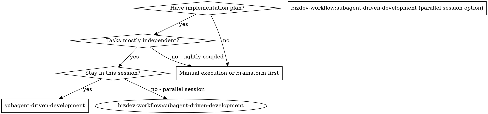
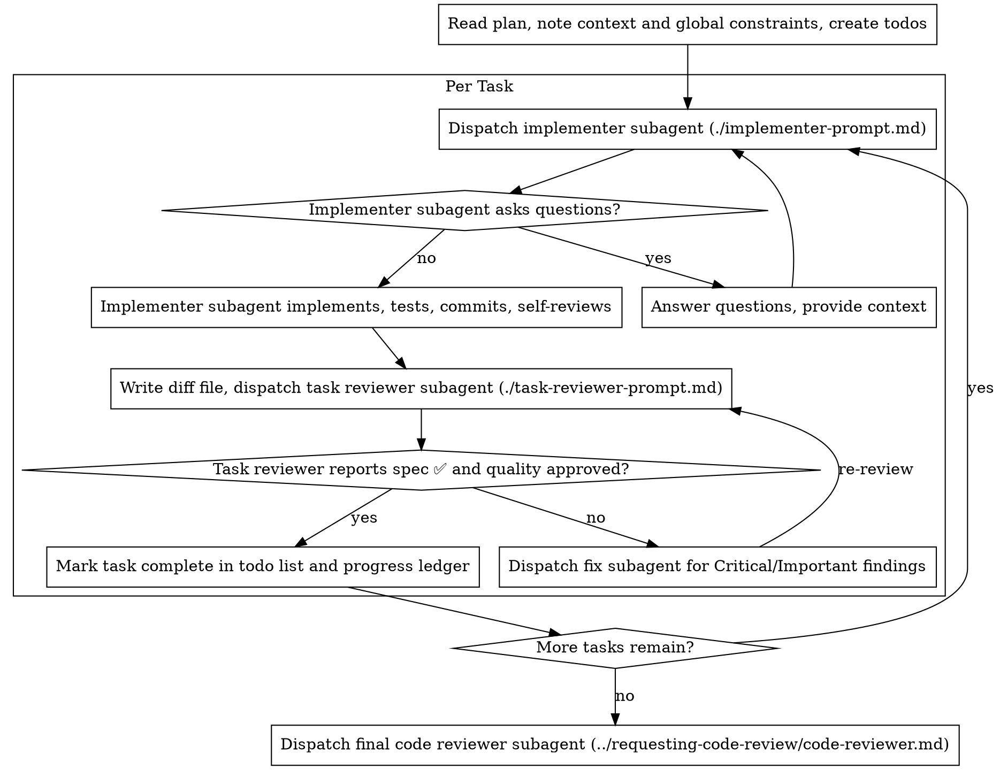

# 子 Agent 驱动开发（Subagent-Driven Development）

通过为每个任务派发一个全新的 implementer subagent，并在每个任务完成后执行一次任务评审（spec compliance + code quality），最后进行一次全量 whole-branch review，来执行计划。

**为何使用 subagent：** 你将任务委托给具有隔离上下文的 specialized agent。通过精确构造它们的指令和上下文，确保它们保持专注并成功完成各自任务。它们绝不应继承你当前会话的上下文或历史记录——你只构造它们需要的内容。这样也能保留你自己的上下文用于协调工作。

**核心原则：** 每个任务使用 fresh subagent + 任务 review（spec + quality）+ 最终 broad review = 高质量、快速迭代

**叙述：** 在工具调用之间，最多叙述一行简短短语——ledger 和工具结果会保留记录。

**持续执行：** 不要在任务之间停下来向 human partner 汇报。按计划执行所有任务，不要停止。停止的唯一理由是：你无法解决的 BLOCKED 状态、真正阻碍进展的歧义、或所有任务已完成。"Should I continue?" 式提示和进度总结会浪费他们的时间——他们让你执行计划，那就执行。

## 何时使用



## 流程



## 执行前计划审查

在派发 Task 1 之前，扫描一次计划，查找冲突：

- 相互矛盾或与计划 Global Constraints 矛盾的任务
- 计划明确要求、但 review rubric 视为缺陷的任何内容（例如：test that asserts nothing、verbatim duplication of a logic block）

将所有发现以一次批处理问题的形式呈现给你的 human partner——每个发现旁边附上计划中要求它的原文，询问哪条规则优先——在 execution 开始前就提出来，而不是在计划执行过程中逐个打断。如果扫描结果干净，则直接继续。review loop 仍然会捕获仅从 implementation 中才暴露出来的冲突。

## Model Selection

为每个角色选择能胜任该工作的最弱 model，以节约成本并提高速度。

**机械 implementation 任务**（独立函数、清晰 spec、1-2 个文件）：使用快速、廉价的 model。当计划 well-specified 时，大多数 implementation 任务都是机械的。

**集成与判断任务**（多文件协调、pattern matching、debugging）：使用标准 model。

**架构与设计任务**：使用能力最强的 available model。最终的 whole-branch review 属于此类——将它派发到能力最强的 available model，而不是 session 默认 model。

**Review 任务**：使用相同的判断标准，根据 diff 的大小、复杂度和风险来缩放。一个小型机械 diff 不需要最强 model；一个微妙的 concurrency 变化则需要。

**派发 subagent 时始终显式指定 model。** 省略的 model 会继承你当前会话的 model——往往是最强且最贵的——这会静默地破坏本节的目标。

**Turn 数优于 token 价格。** Wall-clock 和上下文成本随 subagent 所需 turn 数扩展，最便宜的 model 在多步骤任务上通常要多花 2-3 倍 turn——整体成本反而更高。对 reviewers 和从 prose 描述工作的 implementer，将 mid-tier model 作为下限。当计划的文本包含完整待写代码时，implementation 就是 transcription 加 testing：对这类 implementer 使用最便宜 tier。单文件机械修复也使用最便宜 tier。

**任务复杂度信号（implementation 任务）：**
- 涉及 1-2 个文件且 spec 完整 → 廉价 model
- 涉及多个文件且有集成问题 → 标准 model
- 需要设计判断或广泛 codebase 理解 → 最强 model

## 处理 Implementer 状态

Implementer subagent 报告四种状态之一。分别适当处理：

**DONE：** 生成 review package（`scripts/review-package BASE HEAD`，从本 skill 的目录执行——它打印所写唯一文件路径；BASE 是你在派发 implementer 之前记录的 commit——绝不要使用 `HEAD~1`，这会静默丢弃多 commit 任务中除最后一个之外的所有 commit），然后使用打印的路径派发 task reviewer。

**DONE_WITH_CONCERNS：** Implementer 完成了工作但标记了疑虑。继续之前先阅读这些 concerns。如果 concerns 涉及正确性或 scope，在 review 之前先处理它们。如果只是观察（例如 "this file is getting large"），记录它们并继续 review。

**NEEDS_CONTEXT：** Implementer 需要未提供的信息。提供缺失的上下文并重新派发。

**BLOCKED：** Implementer 无法完成任务。评估 blocker：
1. 如果是上下文问题，提供更多上下文并使用相同 model 重新派发
2. 如果任务需要更多推理，使用更强 model 重新派发
3. 如果任务太大，拆分为更小的 pieces
4. 如果计划本身有误，上报给 human

**绝不要**忽略升级，或在未做任何更改的情况下强制同一 model 重试。如果 implementer 说自己卡住了，那确实需要改变什么。

## 处理 Reviewer ⚠️ 项

Task reviewer 可能会报告 "⚠️ Cannot verify from diff" 项——这些是存在于未变更代码中或跨任务的需求。它们不会阻塞其余 review，但在将任务标记为完成之前，你必须亲自解决每一项：你持有 plan 和跨任务上下文，而 reviewer 缺少这些。如果你确认某项是真实差距，将其视为失败的 spec review——发回 implementer 并重新 review。

## 构造 Reviewer Prompts

Per-task reviews 是 task-scoped gate。Broad review 仅在最终的 whole-branch review 时执行一次。填写 reviewer template 时：

- 不要添加 "check all uses" 或 "run race tests if useful" 这类开放式指令，除非有具体的、任务特定的理由
- 不要让 reviewer 重新运行 implementer 已经对相同代码运行过的测试——implementer 的 report 携带了测试证据
- 不要为 reviewer 预判 findings——绝不要指示 reviewer 忽略或不标记某个特定问题。如果你认为某个 finding 会是 false positive，让 reviewer 提出它，并在 review loop 中裁决。如果你正在写的 prompt 包含 "do not flag"、"don't treat X as a defect"、"at most Minor" 或 "the plan chose"——停止：你在预判，通常是为了给自己省掉一个 review loop。
- 你交给 reviewer 的 global-constraints block 是它的注意力镜头。从计划的 Global Constraints 部分或 spec 中逐字复制 binding requirements：精确值、精确格式、组件间的 stated relationships（"same layout as X"、"matches Y"）。Reviewer 的 template 已经携带了 process rules（YAGNI、test hygiene、review method）——constraints block 用于本项目 spec 所要求的内容。
- 将 diff 作为文件交给 reviewer：运行本 skill 的 `scripts/review-package BASE HEAD`，将 reviewer 打印的文件路径传给它（或者不用 bash：`git log --oneline`、`git diff --stat` 和 `git diff -U10` 针对该范围，重定向到一个唯一命名的文件）。输出永远不会进入你自己的上下文，reviewer 通过一次 Read 调用看到 commit list、stat summary 和带上下文的完整 diff。使用你在派发 implementer 之前记录的 BASE——绝不要使用 `HEAD~1`，这会静默截断多 commit 任务。
- 一次 dispatch prompt 描述一个任务，而不是整个 session 的历史。不要将累积的先前任务摘要（"state after Tasks 1-3"）粘贴到后续派发中——真实 session 的 dispatch 达到过 42k 字符，其中 99% 是粘贴的历史。一个 fresh subagent 需要的是它的任务、它接触的 interfaces、和 global constraints。仅此而已。
- 对 Critical 和 Important findings 派发 fix subagent。在进展 ledger 中记录 Minor findings，并让最终的 whole-branch review 参考该列表，以便它 triage 哪些必须在 merge 前修复。一个没人读的 roll-up 就是静默丢弃。
- 标记为 plan-mandated 的 finding——或任何与计划文本要求冲突的 finding——与任何计划矛盾一样，是 human 的决定：呈现 finding 和计划文本，询问哪条优先。不要因为 plan mandate 就 dismiss 这个 finding，也不要 dispatch 一个与 plan 矛盾的 fix 而不询问。
- 最终的 whole-branch review 也获得一个 package：运行 `scripts/review-package MERGE_BASE HEAD`（MERGE_BASE = 分支起始的 commit，例如 `git merge-base main HEAD`）并将打印的路径包含在最终 review dispatch 中，这样最终 reviewer 读取一个文件，而不是用 git 命令重新推导 branch diff。
- 每次 fix dispatch 携带 implementer contract：fix subagent 重新运行覆盖其更改的测试并报告结果。在 dispatch 中命名覆盖的测试文件——一个单行修复不需要整包 suite。在重新派发 reviewer 之前，确认 fix report 包含覆盖的测试、运行的命令和输出；当这三项都齐全时才派发 re-review。
- 如果最终的 whole-branch review 返回 findings，用完整的 findings list 派发 ONE fix subagent——不要每个 finding 一个 fixer。每个 finding 一个 fixer 都会重建上下文并重新运行 suite；真实 session 的最终 review fix wave 成本超过了所有任务的总和。

## 文件交接

你粘贴到 dispatch prompt 中的所有内容——以及 subagent 打印回来的所有内容——在当前 session 的剩余时间内都驻留在你的上下文中，并在后续每一轮中重新读取。将制品作为文件传递：

- **Task brief：** 在派发 implementer 之前，运行本 skill 的 `scripts/task-brief PLAN_FILE N`——它提取任务的完整文本到一个唯一命名的文件并打印路径。构造 dispatch，使 brief 保持需求的唯一来源。你的 dispatch 应包含：(1) 一行说明该任务在项目中的位置；(2) brief 路径，引入为 "read this first — it is your requirements, with the exact values to use verbatim"；(3) brief 无法知道的、来自先前任务的 interfaces 和决策；(4) 你在 brief 中注意到的任何歧义的解决；(5) report-file 路径和 report contract。精确值（数字、magic strings、signatures、test cases）只出现在 brief 中。
- **Report file：** 将 implementer 的 report 文件以 brief 命名（brief `…/task-N-brief.md` → report `…/task-N-report.md`），并放在 dispatch prompt 中。Implementer 在那里写入完整 report，只返回状态、commits、一行测试总结和 concerns。
- **Reviewer inputs：** Task reviewer 获得三个路径——相同的 brief 文件、report 文件和 review package——以及绑定该任务的 global constraints。
- Fix dispatches 将其 fix report（含测试结果）追加到同一 report 文件，并返回简短摘要；re-reviews 读取更新后的文件。

## 持久化进度

对话记忆在 compaction 后不会保留。在真实 session 中，丢失位置的 controllers 曾重新派发过整个已完成的任务序列——这是观察到的最昂贵的失败。将进度记录在 ledger 文件中，而不仅仅是 todos 中：
- 在 skill 开始时，检查 ledger：`cat "$HOME/.bizdev/<project-key>/<session>-ledger.md"`。其中标记为 complete 的任务就是 DONE——不要重新派发它们；从第一个未标记为 complete 的任务继续。
- 当某个任务的 review 干净返回时，在与其他 bookkeeping 相同的消息中追加一行到 ledger：`Task N: complete (commits <base7>..<head7>, review clean)`。
- Ledger 是你的恢复地图：它命名的 commits 存在于 git 中，即使你的上下文不再记得创建它们。compaction 之后，信任 ledger 和 `git log`，而不是自己的记忆。
- `git clean -fdx` 会销毁 ledger（它是 git-ignored scratch）；如果发生这种情况，从 `git log` 恢复。

## Prompt Templates

- [implementer-prompt.md](implementer-prompt.md) - 派发 implementer subagent
- [task-reviewer-prompt.md](task-reviewer-prompt.md) - 派发 task reviewer subagent（spec compliance + code quality）
- 最终 whole-branch review：使用 bizdev-workflow:requesting-code-review 的 [code-reviewer.md](../requesting-code-review/code-reviewer.md)

## 示例工作流

```
You: I'm using Subagent-Driven Development to execute this plan.

[Read plan file once: docs/superpowers/plans/feature-plan.md]
[Create todos for all tasks]

Task 1: Hook installation script

[Run task-brief for Task 1; dispatch implementer with brief + report paths + context]

Implementer: "Before I begin - should the hook be installed at user or system level?"

You: "User level (~/.config/superpowers/hooks/)"

Implementer: "Got it. Implementing now..."
[Later] Implementer:
  - Implemented install-hook command
  - Added tests, 5/5 passing
  - Self-review: Found I missed --force flag, added it
  - Committed

[Run review-package, dispatch task reviewer with the printed path]
Task reviewer: Spec ✅ - all requirements met, nothing extra.
  Strengths: Good test coverage, clean. Issues: None. Task quality: Approved.

[Mark Task 1 complete]

Task 2: Recovery modes

[Run task-brief for Task 2; dispatch implementer with brief + report paths + context]

Implementer: [No questions, proceeds]
Implementer:
  - Added verify/repair modes
  - 8/8 tests passing
  - Self-review: All good
  - Committed

[Run review-package, dispatch task reviewer with the printed path]
Task reviewer: Spec ❌:
  - Missing: Progress reporting (spec says "report every 100 items")
  - Extra: Added --json flag (not requested)
  Issues (Important): Magic number (100)

[Dispatch fix subagent with all findings]
Fixer: Removed --json flag, added progress reporting, extracted PROGRESS_INTERVAL constant

[Task reviewer reviews again]
Task reviewer: Spec ✅. Task quality: Approved.

[Mark Task 2 complete]

...

[After all tasks]
[Dispatch final code-reviewer]
Final reviewer: All requirements met, ready to merge

Done!
```

## 优势

**vs. 手动执行：**
- Subagents 自然遵循 TDD
- 每个任务使用 fresh context（无混淆）
- Parallel-safe（subagents 不会互相干扰）
- Subagent 可以提问（工作前和工作期间都可以）

**效率提升：**
- Controller 精确策划所需的上下文；批量制品作为文件传递，而非粘贴文本
- Subagent 预先获得完整信息
- 问题在工作开始前就被暴露（而非之后）

**质量门控：**
- Self-review 在交接前捕获问题
- Task review 提供两个 verdict：spec compliance 和 code quality
- Review loops 确保修复真正生效
- Spec compliance 防止过度/不足构建
- Code quality 确保实现 well-built

**成本：**
- 更多 subagent 调用（每个任务一个 implementer + 一个 reviewer）
- Controller 做更多准备工作（提前提取所有任务）
- Review loops 增加迭代次数
- 但尽早捕获问题（比之后 debug 更便宜）

## 警示信号

**绝不要：**
- 在未获得用户明确同意的情况下在 main/master 分支上开始 implementation
- 跳过 task review，或接受缺失任一 verdict 的报告（spec compliance AND task quality 都是必需的）
- 带着未修复的问题继续
- 并行派发多个 implementation subagent（冲突）
- 让 subagent 读取整个计划文件（交给它 task brief——用 `scripts/task-brief` 代替）
- 跳过场景设定上下文（subagent 需要理解任务在项目中的位置）
- 忽略 subagent 的提问（在让他们继续之前先回答）
- 接受 spec compliance 的 "close enough"（reviewer 发现 spec 问题 = 未完成）
- 跳过 review loops（reviewer 发现问题 = implementer 修复 = 再次 review）
- 让 implementer self-review 替代实际 review（两者都需要）
- 告诉 reviewer 不要标记什么，或在 dispatch prompt 中预判 finding 的严重程度（"treat it as Minor at most"）——计划的示例代码是一个起点，而不是其弱点被选择为合理的证据
- 在没有 diff 文件的情况下派发 task reviewer——先生成它（`scripts/review-package BASE HEAD`）并在 prompt 中命名打印的路径
- 在 review 仍有未解决的 Critical/Important 问题时继续下一个任务
- 重新派发一个 progress ledger 已标记为 complete 的任务——在任何 compaction 或 resume 后检查 ledger（和 `git log`）

**如果 subagent 提出疑问：**
- 清晰、完整地回答
- 需要时提供额外上下文
- 不要催促它们进入 implementation

**如果 reviewer 发现问题：**
- Implementer（同一个 subagent）修复它们
- Reviewer 再次 review
- 重复直到 approved
- 不要跳过 re-review

**如果 subagent 任务失败：**
- 使用具体指令派发 fix subagent
- 不要试图手动修复（context pollution）

## 集成

**必需的工作流 skills：**
- **bizdev-workflow:writing-plans** - 创建本 skill 执行的计划
- **bizdev-workflow:requesting-code-review** - 最终 whole-branch review 的 code review 模板

**Subagents 应使用：**

**替代工作流：** 无本期未 vendor 的替代技能，本 skill 即当前会话执行方案。
